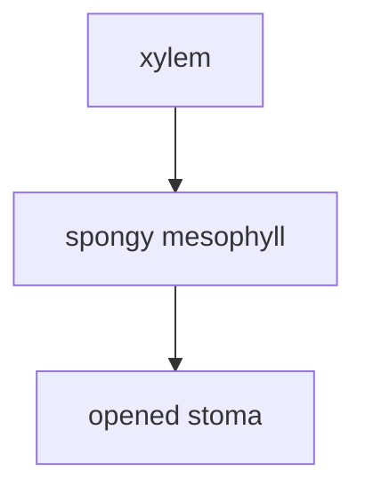

# Cell structures

## Seven characteristics of living organisms

- movement
- respiration
- sensitivity
- growth
- reproduction
- excretion
- nutrition

## Cell theory

- all living organisms are composed of one or more cells
- a cell is the basic unit of living orgainsms
- cells arise from pre-existing cells

## Structures of animal cells

> ![[Pasted image 20220302211135.png]]
>
> 1. nucleus
> 2. rough ER
> 3. ribosomes
> 4. golgi apparatus
> 5. ribosomes
> 6. cell membrane
> 7. mitochondria

> ![[Pasted image 20220302211431.png]]
>
> 1. mitochondria
> 2. chloroplast
> 3. cytoplasm
> 4. vacuole
> 5. cell wall
> 6. cell membrane
> 7. golgi apparatus
> 8. vesicle
> 9. nucleus
> 10. ribosomes
> 11. rough ER
> 12. ribosomes

## Functions of organelles

### Can be seen using light microscope

- nucleus
	- double membrane with pores
	- contains DNA in a form of chromosomes
	- controls the activities of the cell
- cytoplasm
	- site for most chemical reactions in the cell
- vacuole
	- contains cell sap
		- dissolving substances such as ions, lipids and proteins
	- storage of chemical substances
	- maintains turgidity of plant cells
- cell wall
	- outermost and made of cellulose
	- maintain shape and support to the cell
	- prevent cell from bursting when it absorbs water
- chloroplast
	- contain chlorophyll
		- green pigment
	- site of photosynthesis
	- may contain starch grains that act as food stores
- organelles

### Can only be seen using electron microscope

- rough endoplasmic reticulum (rER)
	- membrane network that is studded with ribosomes
	- make proteins in ribosomes and transports them away by vesicles
	- proteins can be transported to the cell membrane and exported or processed inside the cell
- smooth endoplasmic reticulum (sER)
	- bare
		- no ribosomes
	- make lipids eg. steroids
	- responsible for detoxification
- golgi apparatus
	- made of flattened sacs called cisterna
	- responsible for modifying and packaging of proteins
	- proteins are packaged into vesicles for transport
- mitrochondria
	- present in both plant and animal cells
	- site for aerobic respiration
		- releasing energy by breaking down glucose with oxygen and producing carbon dioxide and water
		- glucose + oxygen → carbon dioxide + water
- vesicles
	- structure consisting of liquid enclosed by a phospholipid bilayer
	- formed naturally during the processes of secretion, uptake and transport of materials inside cells
	- many of the organelles in the cell are membrane-bound and that means that they can make their own vesicles
		- allows movement of materials within the cell

## Endocytosis and exocytosis

### Endocytosis

- process where cells take in substances by engulfing them in the cell membrane and forming a vesicle
- phagocytosis
	- absorption of **solids**(cell eating) eg when a white blood cell engulfs a microbe
- pinocytosis
	- taking in of **liquid** by cells(cell drinking)

### Exocytosis

- export of substances
- important for large/ polar molecules to pass through the hydrophobic plasma membrane
- excretion
	- following phagocytosis
	- excrete undigested remains of microbe
- secretion
	- proteins synthesised by ribosomes on rER

## Protein secretion

1. proteins synthesised by ribosomes on rER
2. rER packages the protein into vesicles which pass to the Golgi apparatus
3. protein is modified eg adding a carbohydrate and packaged in vesicles
4. vesicles fuse with the plasma membrane for secretion

## Prokaryotes and eukaryotes

### Prokaryotes

- organisms whose cells **lack nucleus**
- simple structure without membrane-bound organelles eg nucleus, mitochondria
	- eg. bacteria

### Eukaryotes

- have membrane-bound organelles including nucleus
	- eg. animals, plants and fungi

# Specialized cells - transport system in plants 1

## Structure of leaf

> ![[Pasted image 20220302215449.png]]
>
> 1. cuticle
> 2. upper epidermis
> 3. palisade
> 4. spongy
> 5. lower epidermis
> 6. xylem
> 7. phloem
> 8. guard cells
> 9. stoma

> 3D image![[Pasted image 20220302220119.png]]

> ![[Pasted image 20220302220223.png]]
>
> 1. upper epidermis
> 2. palisade
> 3. spongy
> 4. lower epidermis
> 5. guard cell
> 6. xylem
> 7. phloem

## Transpiration

- loss of water vapour from stems and leaves of plants
- water is absorbed from the soil by the roots and flows, via the xylem, to the leaves
- water in the leaves evaporates away via the stomata
- diffusion

## Stomata

- pores on the underside of the leaf which facilitate gas exchange
- open as gas exchange is needed for photosynthesis
	- CO2 enters
	- O2 leaves

## Water loss in plants

- as stomata open, water evaporates from the leaf surface
	- transpiration occur
- transpiration is an inevitable consequence of gas exchange in the leaf
- transpiration will be affected by the rate of photosynthesis

## Regulation of water loss

- rate of water lost from leaves(transpiration rate) is regulated by the opening and closing of stomata
- transpiration rates will be higher when stomata are opened
- guard cells are on two sides of the stomata and can change shape to open or close the stomata

## Opening of stomata

- when the plant is hydrated, guard cells become turgid
- inner cell walls are thicker than the outer cell walls
- outer cell walls stretch and inner cell walls are pulled apart -> stomata opens

## Closing of stomata

- when the plant is dehydrated, guard cells become increasingly flaccid
- outer cell walls are less stretched -> stomata closes

## Water loss from leaves

1. evaporation of water from the spongy mesophyll to the air space
2. diffusion of water vapour out of the leaf via stomata

## Osmolarity

- solutions with a high solute concentration are categorised as **hypertonic** -> gains water by osmosis
- solutions with a low solute concentration are categorised as **hypotonic** -> loses water by osmosis
- solutions that have same solute concentration are categorised as **isotonic** (no net water flow)

## Effect of osmosis on plant cells

- hypertonic
	- cytoplasm will shrink (plasmolysis) but cell wall will maintain a structured shape
- hypotonic
	- cytoplasm will expand but unable to rupture with in the constraints of the cell wall (turgor)
- isotonic
	- flaccid

## Evaporation in leaf tissues

- water is lost from the leaves when it is evaporates and diffuses from the stomata
- creates tension(pulling) force, drawing water from xylem due to adhesion between water and the leaf cell walls

# Specialized cells - transport system in plants 2

## Transpiration pull/ stream

- the flow of water from roots through xylem to the leaves against gravity is called **transpiration stream**
- water rises through xylem vessels due to two key properties of water - cohesion and adhesion

### Cohesion

- the force of attraction between two water molecules
- polar and hydrogen bonding
- causes water molecules to be pulled up the xylem towards the leaves in a continuous stream

### Adhesion

- the force of attraction between water molecules and xylem wall
- xylem wall is also polar, hydrogen bonding
- capillary action

## Cohesion-tension theory

- water evaporates through stomata
- as water evaporates from the leaves, a water column is pulled up -> tension
- when water travels in thin tubes like xylem vessels, there is a strong cohesion between the water molecules
- column of water in a xylem vessel can reach up to 100m tall

---

## Uptake of water and minerals in roots

### Root uptake

- plants take up water and mineral ions from the soil via their roots
- the epidermis of roots may have cellular extensions called root hairs, which increases the surface area for absorption
- materials absorbed **diffuse** towards the xylem

### Mineral uptake

- minerals ions that need to be taken up from the soil include magnesium(chlorophyll), nitrate(chlorophyll, nucleic acid, amino acid), phosphate(nucleic acid, cell membrane), sodium and potassium
	- (Mg, N, P, Na, K)
- mineral ions may passively diffuse into roots, but are more commonly loaded by active transport

### Water uptake

- water will follow mineral ions into the root via osmosis
	- moving towards the region with a higher solute concentration (lower water potential)
- once inside the root, water will move towards the xylem

1. minerals in lower concentration in the soil than in cell cytoplasm -> active transport -> root epidermal cell
2. soil water has a higher concentration than root hair cell sap -> osmosis -> root epidermal cell

#### Symplastic pathway

- water moves through the cytoplasm of cells (connected via plasmodesmata)

- connected via plasmodesmata

#### Apoplastic pathway

- water moves through cell wall until it reaches the Casparian strip, which is impermeable to water
- water switches to symplastic pathway to prevent pathogen invasion

## Structure of xylem

### Xylem

- transports water and mineral salts only
- from the root to the leaves
- the movement of water is a passive process and occurs in one direction only
- the cell wall contains numerous pores called pits, which enables water to be transferred between cells
