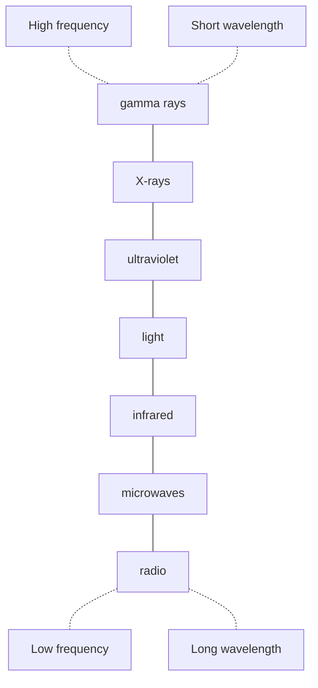

# Electromagnetic radiation
## Properties of EM radiation
1. All types of electromagnetic radiation travel through a vacuum at $3\times10^8 ms^{-1}$, i.e. with the speed of light.
2. They exhibit interference, diffraction, and polarisation, which suggests they have a transverse wave nature.
3. They obey the wave equation, $v=f\lambda$, where $v$ is the speed of light, $f$ is the frequency of the waves and $\lambda$ is the wavelength. Since $v$ is constant for a particular medium, it follows that large $f$ means small $\lambda$.
4. They carry energy from one place to another and can be absorbed by matter to cause heating and other effects. The higher the frequency and the smaller the wavelength of the radiation, the greater is the energy carried, i.e. gamma rays are more 'energetic' than radio waves.

